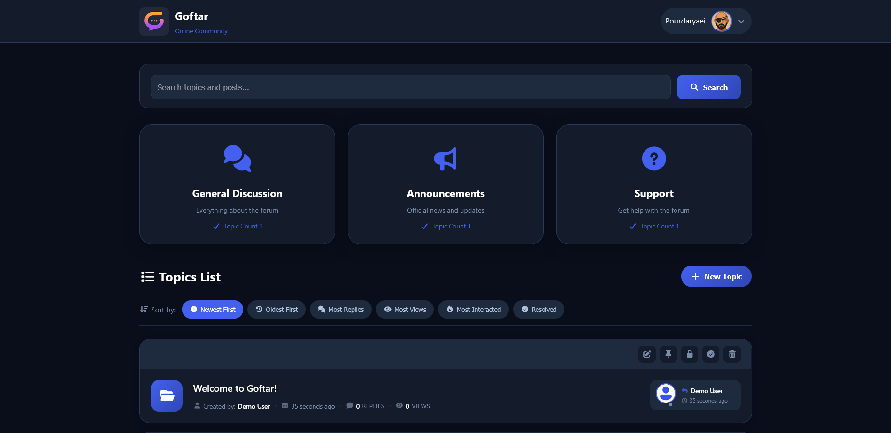
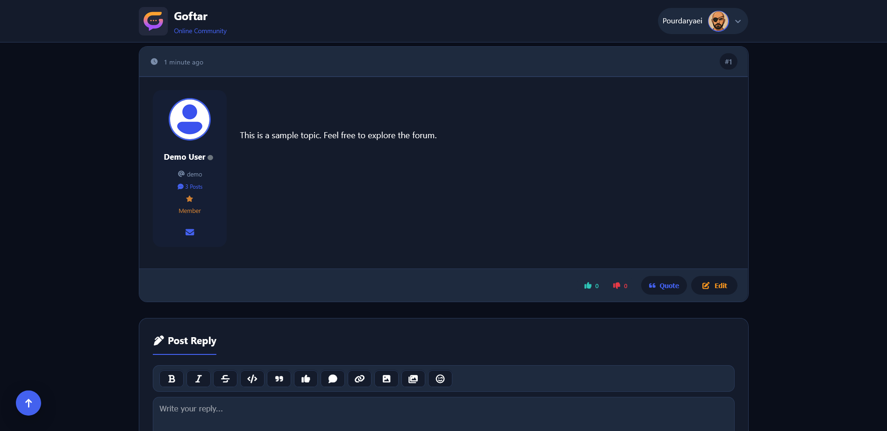
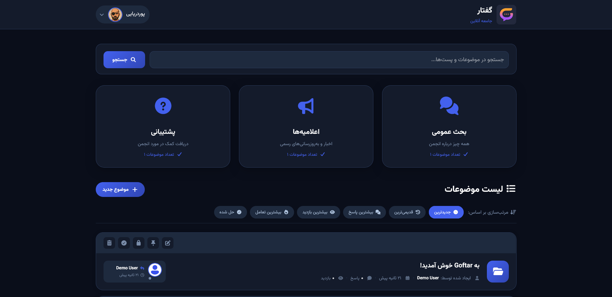
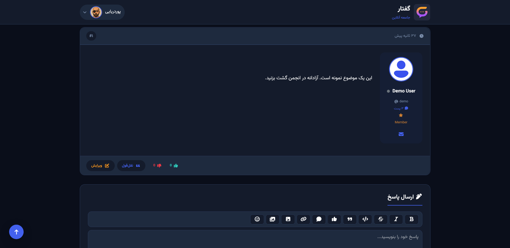

<div align="center">


# Goftar

**Modern, Secure, Open-Source Forum Builder with Full RTL/LTR Support**

[](https://opensource.org/licenses/MIT)
[](https://php.net)
[](https://github.com/abdulhalim/Goftar)

🇮🇷 **[Read this in Persian / فارسی](./README.fa.md)**

</div>

---

> ## ⚠️ Product Status: **Beta (v1.0.2)**
>
> Goftar is currently in **public beta testing**. Core features are implemented and functional. Recommended for staging and testing environments. Not yet recommended for large-scale production deployment.

---

## 📸 Screenshots

| Forum Homepage | Topic View |
|:---:|:---:|
|  |  |

| RTL Homepage (Persian) | RTL Topic View |
|:---:|:---:|
|  |  |

---

## 🎯 What is Goftar?

Goftar (گفتار) is a lightweight, self-hosted forum platform built with PHP and SQLite — designed from the ground up for communities that speak RTL languages like Persian, Arabic, and Urdu. It delivers a modern user experience with zero external database dependencies, making it incredibly easy to deploy on any shared hosting or VPS.

**Why Goftar?**

- **No MySQL needed** — runs entirely on a single SQLite file
- **RTL-first design** — not an afterthought, the entire interface is built with bidirectional layout support using CSS logical properties
- **Truly lightweight** — no heavy frameworks, no Composer dependencies, no Node.js build step. Just upload and run.
- **Feature-rich** — polls, gated content, galleries, NSFW system, static pages CMS, file uploads with quota management, and a powerful admin panel — all out of the box

---

## ✨ Key Features

### Content & Editor
| Feature | Description |
|---------|-------------|
| 🗳️ **Polls** | Create polls in topics with single/multiple vote types and Chart.js visualizations (pie, bar, doughnut, polarArea) |
| 🖼️ **Gallery BBCode** | Insert image galleries with multi-file upload, external URL support, and GLightbox viewer |
| 🔒 **Gated Content** | Lock content behind likes (`[like]`) or replies (`[reply]`) — users must interact to reveal |
| 👁️ **NSFW System** | Age-verified content gates with blur overlay and per-topic cookie-based verification |
| 🎵 **Audio Player** | Embedded audio playback via Plyr with lightbox integration |
| 📥 **Video Embed** | Embed videos from YouTube, Aparat, Vimeo, and direct links |
| 📥 **Download Box** | Attach downloadable files to posts with file details |
| 😊 **Emoji Picker** | Quick emoji insertion with responsive dropdown |
| 📋 **Code Copy** | Auto-injected copy button on code blocks |
| 💬 **Quote Reply** | One-click quote with author attribution |
| ✨ **Markdown Editor** | Full Markdown toolbar with bold, italic, strikethrough, code, and blockquote |

### Pages & CMS
| Feature | Description |
|---------|-------------|
| 📄 **Static Pages** | Create custom pages (About, Rules, Privacy) with Markdown/HTML, slug-based URLs, and automatic footer menu integration |

### Admin & Moderation
| Feature | Description |
|---------|-------------|
| 📝 **Admin Notes** | Internal staff notes/tickets with priority levels, status tracking, assignee management, and @mention notifications |
| 📈 **Statistics Dashboard** | 5 interactive Chart.js visualizations — hourly/weekly activity, monthly trends, category breakdown, user growth |
| 📁 **Upload Management** | Per-user quota system, category filtering, auto WebP conversion, admin approval workflow |
| 👁️ **Guest Content Control** | 7 individual settings to hide specific content types from guests (videos, audio, galleries, gated content, NSFW, links) |
| 🛡️ **WAF** | Web Application Firewall with configurable protection levels |
| 🔗 **Domain Whitelists** | CSP and redirect domain whitelisting with subdomain wildcard support |

### Security
| Feature | Description |
|---------|-------------|
| 🔒 **CSRF Protection** | Token-based CSRF validation on all forms and AJAX requests |
| 🛡️ **XSS Prevention** | Output encoding, content sanitization, and DOM-safe rendering |
| 🔑 **2FA** | Two-factor authentication with TOTP (QR code setup + backup codes) |
| 🚫 **IP Blocking** | Manual and WAF-driven IP ban system |
| ⏱️ **Rate Limiting** | Request rate limiting to prevent abuse |
| 📧 **SMTP Support** | Full email configuration with TLS/SSL encryption |
| 📊 **Analytics Injection** | Custom tracking code injection (Google Analytics, etc.) |

### UI & Experience
| Feature | Description |
|---------|-------------|
| 🌙 **Dark / Light Theme** | CSS custom property-based theming with dynamic switching |
| 📱 **Fully Responsive** | Three breakpoints — desktop, tablet (768px), mobile (550px) |
| 🌐 **RTL / LTR** | Complete bidirectional support using CSS logical properties |
| 🔔 **Real-Time Notifications** | Polling-based notification bars for PMs and topic updates |
| 🖼️ **GLightbox** | Full image/video lightbox with Plyr-powered playback and touch navigation |

---

## 🏢 Enterprise-Grade Security Architecture

Goftar implements a **defense-in-depth** security model that combines multiple layers of protection, designed to meet the stringent requirements of enterprise and government-grade deployments. The security infrastructure operates at every level of the application stack — from network perimeter to application logic to data storage.

**Perimeter Defense — Web Application Firewall (WAF)**
The built-in WAF engine performs real-time traffic inspection and pattern matching against a comprehensive rule set that covers OWASP Top 10 threats, SQL injection vectors, cross-site scripting payloads, and directory traversal attempts. It operates with configurable sensitivity levels (Low, Normal, High, Extreme) and maintains detailed audit logs of all blocked requests, enabling security teams to perform forensic analysis and threat hunting. The WAF can be customized with allowlist rules for trusted IP ranges and specific endpoint exceptions.

**Identity & Access Management**
Goftar enforces a robust authentication framework with multi-factor verification. Administrators and users can enable TOTP-based two-factor authentication (2FA) via QR code enrollment, backed by one-time backup codes for disaster recovery. Session management includes CSRF token rotation, secure cookie attributes (HttpOnly, SameSite), and configurable session timeouts. Password policies are enforced server-side with configurable complexity requirements.

**Runtime Protection**
The rate limiting engine guards against brute-force attacks, DDoS attempts, and API abuse by tracking request frequency per IP address and per user session. Thresholds are configurable and violations trigger automatic temporary bans with exponential backoff. The IP blocking system supports both manual blacklisting and automated WAF-driven bans, with granular CIDR notation support for network-level blocking.

**Data Security**
All user-generated content passes through a multi-stage sanitization pipeline that strips malicious HTML, encodes output entities, and validates file uploads against MIME-type whitelists and size quotas. The upload security module performs malware scanning integration and enforces per-user storage quotas with daily upload limits. External links are routed through a redirect gateway with domain whitelisting and CSP header enforcement to prevent phishing and data exfiltration.

**Compliance & Audit Trail**
Every security-relevant action — from login attempts and permission changes to content moderation and administrative configuration — is recorded in a structured audit log with timestamps, IP addresses, and user identifiers. This comprehensive trail supports compliance requirements for SOC 2, ISO 27001, and similar frameworks, giving organizations full visibility into platform activity.

---

## 🧱 Technical Architecture

| Component | Technology |
|-----------|-----------|
| **Backend Language** | PHP 7.4+ (no frameworks, vanilla PHP) |
| **Database** | SQLite — single file, zero configuration |
| **Frontend** | Vanilla JavaScript + jQuery, CSS Custom Properties |
| **Icons** | Font Awesome 7.1 |
| **Markdown** | Parsedown (PHP) with custom BBCode extensions |
| **Charts** | Chart.js |
| **Lightbox** | GLightbox + Plyr (video/audio) |
| **Font** | VazirMatn (Persian/Arabic), system fonts (Latin) |
| **Authentication** | TOTP-based 2FA + QR code enrollment |
| **i18n** | Separate language files (Persian, English, Russian) |

---

## 🔧 Requirements

Before installing Goftar, make sure your server meets these minimum requirements:

| Requirement | Minimum | Recommended |
|-------------|---------|-------------|
| **PHP** | 7.4 | 8.1+ |
| **PHP Extensions** | `sqlite3`, `gd`, `mbstring` | `sqlite3`, `gd`, `mbstring`, `openssl`, `curl` |
| **Web Server** | Apache (with `mod_rewrite`) or Nginx | Apache 2.4+ |
| **Disk Space** | ~20 MB for files | ~50 MB (with uploads) |
| **Permissions** | Write access to `storage/` and `config/` | — |

> **Shared Hosting?** Goftar works perfectly on shared hosting. No MySQL, no Composer, no special server configuration needed.

---

## 🚀 Installation

### Step 1 — Download & Upload

Download the latest release from [GitHub Releases](https://github.com/abdulhalim/Goftar/releases) and upload all files to your web server's document root (e.g., `public_html`, `htdocs`, or `var/www/html`).

```bash
# Or clone via Git
git clone https://github.com/abdulhalim/Goftar.git /path/to/your/site
```

### Step 2 — Set Permissions

Make sure the web server can write to the storage and config directories:

```bash
chmod -R 755 storage/
chmod -R 755 config/
```

### Step 3 — Run the Installer

Open your site URL in a browser. You'll be automatically redirected to the multi-language installer. The installer will:

1. **Check server requirements** — verifies PHP version and required extensions
2. **Site configuration** — enter your site title, slogan, and URL
3. **Admin account** — create the administrator username, display name, and password
4. **Security questions** — set up recovery questions for password reset
5. **Review & Install** — confirm all settings and click Install

> The installer automatically creates the SQLite database and disables itself after completion.

### Step 4 — Start Using Your Forum

After installation:

1. Log in with your admin credentials
2. Go to **Admin Panel** (from the user menu)
3. Create your first **category** under Category Management
4. Start creating topics and inviting users

That's it — your forum is ready. No additional configuration required.

---

## 📁 Project Structure

```
goftar/
├── admin/              # Admin panel pages
│   ├── css/           # Admin stylesheets
│   ├── settings.php   # Site settings
│   ├── users.php      # User management
│   ├── topics.php     # Topic management
│   ├── posts.php      # Post management
│   ├── polls.php      # Poll management
│   ├── notes.php      # Admin notes/tickets
│   ├── stats.php      # Statistics & charts
│   ├── static_pages.php # CMS page management
│   └── ...
├── api/               # API endpoints (AJAX)
├── assets/            # Frontend assets (CSS, JS, images)
├── functions/         # Core PHP functions
│   ├── markdown.php   # Markdown + BBCode parser
│   ├── gallery.php    # Gallery processor
│   ├── admin_notes.php # Admin notes backend
│   └── ...
├── handlers/          # Form handlers (AJAX)
├── includes/          # Shared components
│   ├── header.php     # HTML head + navigation
│   ├── footer.php     # Footer + analytics
│   ├── security/      # Security framework
│   └── ...
├── install/           # Installer (auto-disabled after use)
├── lang/              # Language files
│   ├── en/           # English
│   ├── fa/           # Persian (Farsi)
│   └── ru/           # Russian
├── public/            # Frontend pages
│   ├── templates/    # Page templates
│   └── pm/           # Private messaging
├── theme/             # Theme system
│   └── default/      # Default theme
├── vendor/            # Third-party libraries
├── config/            # Configuration files (writable)
├── storage/           # Database & uploads (writable)
├── index.php          # Front controller
└── robots.php         # Robots.txt generator
```

---

## 📚 Third-Party Libraries

| Library | Purpose | License |
|---------|---------|---------|
| [Font Awesome 7.1](https://fontawesome.com/) | Icon set and toolkit | CC BY 4.0 |
| [Parsedown](https://parsedown.org/) | Markdown parser for PHP | MIT |
| [GLightbox](https://github.com/biati-digital/glightbox) | Modern lightbox viewer | MIT |
| [Plyr](https://plyr.io/) | Audio/Video player | MIT |
| [Chart.js](https://www.chartjs.org/) | JavaScript charting library | MIT |
| [VazirMatn](https://github.com/rastikerdar/vazirmatn) | Persian/Arabic typeface | SIL OFL 1.1 |
| [QRCode.js](https://github.com/davidshimjs/qrcodejs) | QR code generator | MIT |
| [jQuery](https://jquery.com/) | DOM manipulation | MIT |

---

## 🤝 Contributing

Contributions, bug reports, and feature requests are welcome. Please feel free to submit issues or pull requests on GitHub.

---

## 📄 License

This project is released under the **MIT License**.

---

<div align="center">

**Goftar** — A secure, fast, RTL-ready forum platform for any community.

🔗 [GitHub Repository](https://github.com/abdulhalim/Goftar)

</div>
